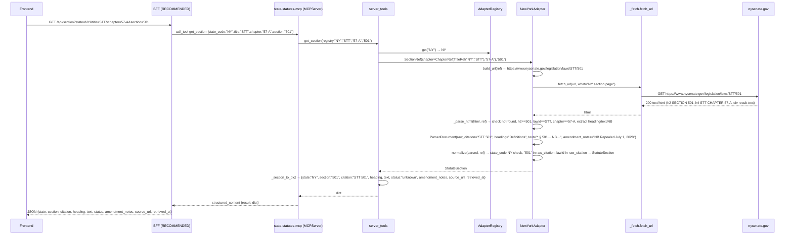
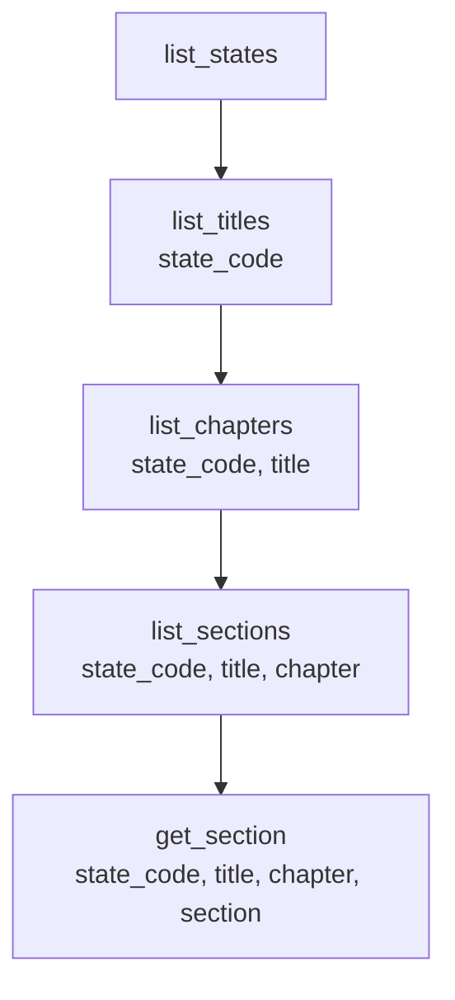
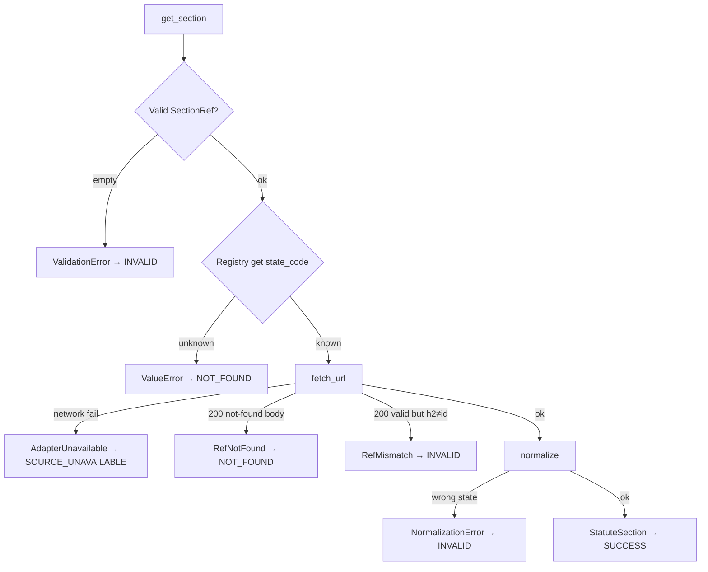
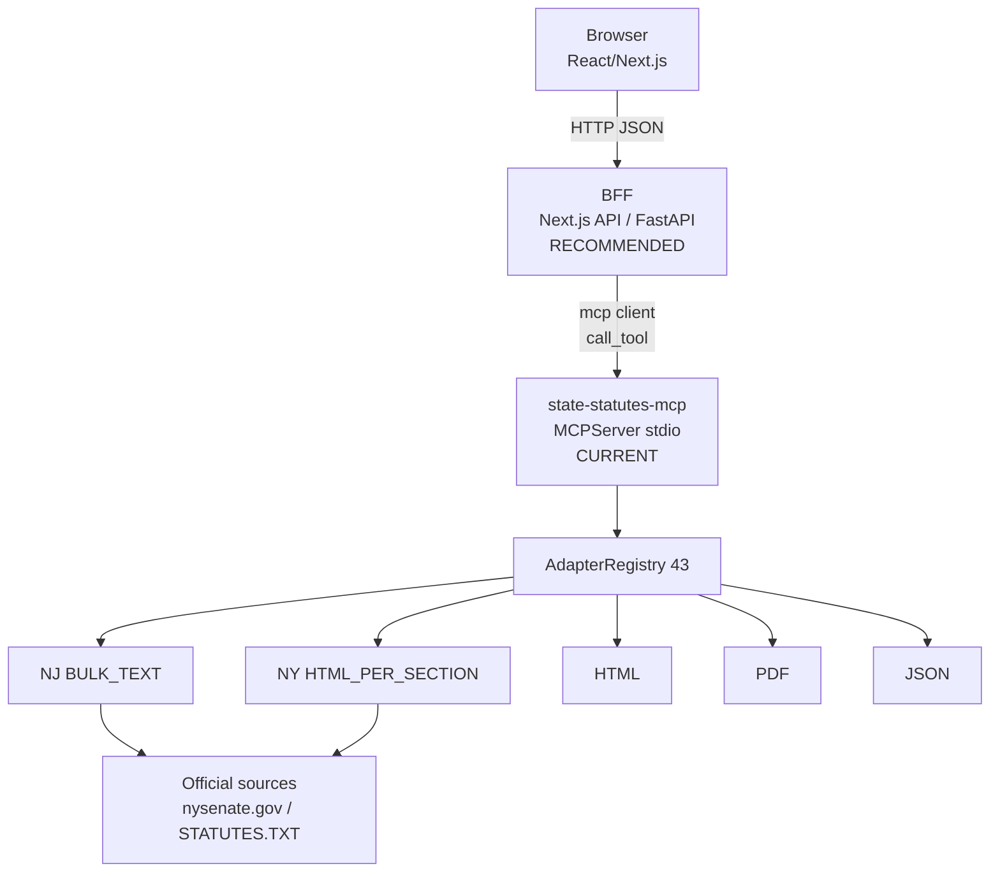
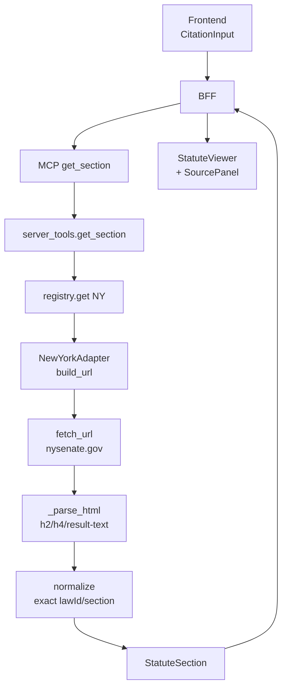
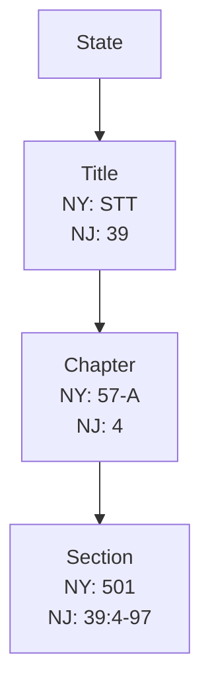

# Frontend Integration & System Workflow Guide

**Prepared by: Vaibhav Vikas Ranjan**

**Verified baseline:** `a87b4f3` + GA (#44, Archive.org OCGA) = 44/50, `1488 collected, 1487 passed, 1 skipped`, `git diff --check` clean (B94 GREEN)
**Source of truth:** `src/state_statutes_mcp/`, `tests/`, `pyproject.toml`, registry, MCP tools — not historical reports

## Table of Contents

1. Executive Summary
2. Verified Current System
3. Complete Repository Map
4. Current MCP/API Surface
5. Current Integration Boundary
6. Domain Models & Frontend Data Contract
7. Exact Field Origin Trace
8. Detailed Single-Clause Workflow
9. 44-State Adapter Architecture
10. Discovery Workflow
11. Search Capabilities
12. Error Contract
13. Loading / Empty / Error States
14. Source Provenance
15. New York Integration Notes
16. New Jersey Integration Notes
17. B82.1 Verified Backend Baseline
18. Security Boundaries
19. LLM Integration
20. Recommended ChatGPT/Claude-Like Frontend
21. Recommended Frontend Architecture
22. Frontend Component Contracts
23. Caching Strategy
24. Persistence & History
25. Legal/Product UX Considerations
26. Frontend Readiness Audit
27. Current Limitations
28. Integration Checklist
29. What the Frontend Developer Needs to Know

---

## 1. Executive Summary

**CURRENT IMPLEMENTATION:** `state-statutes-mcp` is an MCP (Model Context Protocol) server that retrieves US state statutes from official state sources via per-state adapters. `44/50` states are implemented (NJ `#42` via bulk `STATUTES.TXT`, NY `#43` via `nysenate.gov` HTML-per-section, GA `#44` via Archive.org OCGA bulk `gov.ga.ocga.2024`). The backend exposes **5 MCP tools** over **stdio** (`mcp.server.mcpserver.MCPServer`), not a REST/HTTP API. All retrieval is deterministic (`citation → exact section`) with explicit `RefNotFoundError`/`RefMismatchError` handling, fixture-backed offline tests, and no live government fetch in `pytest`.

**RECOMMENDED:** A BFF/application backend that speaks MCP (via `mcp` client) and exposes a typed HTTP/JSON API to a React/Next.js frontend. **FUTURE:** LLM summarization, persistence, full-text search are not implemented.

## 2. Verified Current System

- **Branch:** `feature/framework`, **HEAD:** `a87b4f3` (B94) + GA (#44) = 44/50 (verified via `git status --short`)
- **Adapters:** 44 dirs under `src/state_statutes_mcp/adapters/` (`alaska` … `wyoming` includes `georgia`, `new_jersey`, `new_york`)
- **Registry:** `src/state_statutes_mcp/server.py:build_registry()` registers 44 explicitly, `src/state_statutes_mcp/server_tools.py` is the pure tool layer
- **Tests:** `1488 collected, 1487 passed, 1 skipped` (Illinois), `python -m compileall` silent
- **States:** `AK AL AZ CA CO CT DE FL GA HI IA ID IL KS KY MA MD ME MI MN MO MT NC ND NE NH NJ NM NV NY OH OK OR PA RI SC SD TX VA VT WA WI WV WY` (sorted, from `build_registry()`)

## 3. Complete Repository Map

| File | Purpose | Runtime/Test/Docs | Frontend relevance | Priority |
|------|---------|-------------------|--------------------|----------|
| `src/state_statutes_mcp/server.py` | MCP server, `build_registry()`, `build_server()` registers 5 tools | Runtime | **P0** — tool surface | P0 |
| `src/state_statutes_mcp/server_tools.py` | Pure `list_states`, `list_titles`, `list_chapters`, `list_sections`, `get_section(registry,…)` | Runtime | **P0** — actual logic behind tools | P0 |
| `src/state_statutes_mcp/core/registry.py` | `AdapterRegistry` (`register`, `get`, `is_registered`, `list_state_codes`, `DuplicateAdapterError`/`UnknownStateError`) | Runtime | P0 — state routing | P0 |
| `src/state_statutes_mcp/adapters/base.py` | `BaseStateAdapter` abstract: `state_code`, `state_name`, `build_url`, `list_titles`, `list_chapters`, `list_sections`, `normalize` + required `retrieve_section` | Runtime | P0 — contract | P0 |
| `src/state_statutes_mcp/adapters/new_york/adapter.py` | NY live HTML-per-section (`nysenate.gov`) | Runtime | P0 — NY behavior | P0 |
| `src/state_statutes_mcp/adapters/new_jersey/adapter.py` | NJ bulk `STATUTES.TXT` deterministic index | Runtime | P0 — NJ behavior | P0 |
| `src/state_statutes_mcp/adapters/{state}/adapter.py` (41 others) | Per-state retrieval (PDF/HTML/JSON families) | Runtime | P1 — patterns | P1 |
| `src/state_statutes_mcp/models/refs.py` | `TitleRef`, `ChapterRef`, `SectionRef` | Runtime | P0 — refs | P0 |
| `src/state_statutes_mcp/models/documents.py` | `ParsedDocument` | Runtime | P1 — intermediate | P1 |
| `src/state_statutes_mcp/models/statute_section.py` | `StatuteSection`, `StatuteStatus` | Runtime | **P0** — final model | P0 |
| `src/state_statutes_mcp/models/citation.py` | `Citation` | Runtime | P1 — citation | P1 |
| `src/state_statutes_mcp/models/hierarchy.py` | `TocNode`, `HierarchyLevel` | Runtime | P0 — discovery | P0 |
| `src/state_statutes_mcp/adapters/_fetch.py` | `fetch_url`, `fetch_bytes`, `fetch_graphql` (single `urllib.request.urlopen`, 30s timeout → `AdapterUnavailableError`) | Runtime | P1 — network boundary (mocked in tests) | P1 |
| `src/state_statutes_mcp/adapters/_htmltext.py` | `strip_tags` | Runtime | P2 | P2 |
| `src/state_statutes_mcp/core/exceptions.py` | `StateStatutesError` → `AdapterUnavailableError`, `RefNotFoundError`, `RefMismatchError`, `NormalizationError`, `UnsupportedRefError`, `PartialListingError` | Runtime | **P0** — errors | P0 |
| `tests/_mock_network.py` | `mock_urlopen*` patching `state_statutes_mcp.adapters._fetch.urllib.request.urlopen` | Test | P1 — how fixtures work | P1 |
| `tests/fixtures/new_york/*.html` (7) | Verbatim `nysenate.gov` slices (STT 501/502/500/INVALID, VAT 1109/1110/1111) | Test | P0 — NY fixtures | P0 |
| `tests/fixtures/new_jersey/statutes.txt` | 7996 B representative slice of `STATUTES.TXT` | Test | P0 — NJ fixture | P0 |
| `tests/test_new_york_adapter.py` (23 tests) | NY fixture-based offline | Test | P0 | P0 |
| `tests/test_new_jersey_adapter.py` (21 tests) | NJ fixture-based | Test | P0 | P0 |
| `tests/test_server.py`, `tests/test_server_tools.py` | Registry/server integration | Test | P1 | P1 |
| `README.md` | 44/50, table, architecture, roadmap | Docs | P1 | P1 |
| `pyproject.toml` | `setuptools`, `pydantic>=2`, `mcp>=2.0`, `pypdf`, `pytest` `pythonpath=["src"]` | Config | P2 | P2 |
| `docs/research/*.md` | Per-state verification notes | Docs | P2 | P2 |

## 4. Current MCP/API Surface

**CURRENT IMPLEMENTATION:** MCP tools via `mcp.server.mcpserver.MCPServer` over **stdio** (`server.py:main() → build_server().run(transport="stdio")`). **No REST/HTTP API is exposed by this repository.**

| Tool | Inputs (all `str`, required) | Output | Verified file |
|------|-------------------------------|--------|---------------|
| `list_states` | — | `list[dict]` `{state_code, state_name}` sorted | `server.py:143` → `server_tools.list_states` |
| `list_titles` | `state_code` | `list[dict]` `{level, identifier, name}` via `_node_to_dict` | `server.py:148` → `server_tools.list_titles` |
| `list_chapters` | `state_code`, `title` | `list[dict]` | `server.py:155` |
| `list_sections` | `state_code`, `title`, `chapter` | `list[dict]` | `server.py:165` |
| `get_section` | `state_code`, `title`, `chapter`, `section` | `dict` `{state, section, citation, heading, text, status, amendment_notes, source_url, retrieved_at}` via `_section_to_dict` | `server.py:174` → `server_tools.get_section` |

Exceptions propagate as `StateStatutesError` subclasses; MCP layer surfaces them as tool errors. No pagination, no search tool.

**`server_tools.py` pure functions** (testable without MCP SDK) have identical signatures but take `registry: AdapterRegistry` as first arg.

## 5. Current Integration Boundary

### CURRENT IMPLEMENTATION

- **Browser → MCP server directly:** **NOT supported.** MCP uses `stdio` transport; browsers cannot speak stdio. No `CORS`, no `HTTP` route, no `REST` endpoint exists in this repo.
- **Existing transport:** `MCPServer` over stdio, intended for an MCP client (e.g., Claude Desktop, or a backend using `mcp` client library).
- **Existing MCP client:** None in repo (only `mcp` SDK dependency).
- **Auth:** None.
- **Frontend:** None.

### RECOMMENDED — NOT CURRENTLY IMPLEMENTED

Build a **BFF (Backend-for-Frontend)** — e.g., Next.js API routes or FastAPI — that:

1. Imports `build_registry()` (or `build_server()` and calls tools via `server.call_tool`),
2. Exposes typed HTTP `GET /api/states`, `/api/titles?state=NY`, `/api/sections?...`, `/api/section?...`
3. Handles CORS, validation, error mapping to HTTP status, caching, and logging.

Clearly label this as **RECOMMENDED**.

## 6. Domain Models & Frontend Data Contract

**VERIFIED** via `src/state_statutes_mcp/models/`:

| Model | Fields | Required | Example | Producer | Frontend significance |
|-------|--------|----------|---------|----------|-----------------------|
| `TitleRef` | `state_code: str (2, upper)`, `identifier: str`, `name: str\|None` | `state_code`, `identifier` | `TitleRef(state_code="NY", identifier="STT")` | `list_titles` | Title key |
| `ChapterRef` | `title: TitleRef`, `identifier: str`, `name: str\|None` + computed `state_code` | `title`, `identifier` | `ChapterRef(title=TitleRef("NY","STT"), identifier="57-A")` | `list_chapters` | Chapter key |
| `SectionRef` | `chapter: ChapterRef`, `identifier: str`, `name: str\|None` + computed `state_code` | `chapter`, `identifier` | `SectionRef(chapter=ChapterRef(TitleRef("NY","STT"),"57-A"), identifier="501")` | `list_sections`/`CitationInput` | **Section key for `get_section`** |
| `TocNode` | `level: HierarchyLevel`, `identifier: str`, `name: str`, `ref: TitleRef\|ChapterRef\|SectionRef`, `children: tuple` | all | `TocNode(level=TITLE, identifier="STT", name="State Technology (STT)", ref=TitleRef(...))` | `list_*` | Discovery tree node |
| `Citation` | `state_code: str`, `raw: str`, `formatted: str\|None`, `section: SectionRef\|None` | `state_code`, `raw` | `Citation(state_code="NY", raw="STT 501")` | `normalize` | Display citation |
| `ParsedDocument` | `raw_citation: str`, `heading: str\|None`, `text: str`, `amendment_notes: str\|None`, `source_url: str\|None`, `retrieved_at: datetime\|None` | `raw_citation`, `text` | `ParsedDocument(raw_citation="STT 501", heading="Definitions", text="…")` | adapter `_parse` | **Not frontend-visible** (intermediate) |
| `StatuteSection` | `ref: SectionRef`, `citation: Citation`, `heading: str\|None`, `text: str`, `status: StatuteStatus`, `amendment_notes: str\|None`, `source_url: str\|None`, `retrieved_at: datetime\|None` | `ref`, `citation`, `text` | `StatuteSection(ref=…, citation=Citation(raw="STT 501"), heading="Definitions", text="* § 501…", status=UNKNOWN)` | `retrieve_section` → `normalize` | **Final statute** |
| `StatuteStatus` | enum `UNKNOWN`, `IN_FORCE`, `AMENDED`, `REPEALED`, `RENUMBERED`, `EXPIRED` | — | `UNKNOWN` (default for NY/NJ) | `normalize` | Status badge |
| `HierarchyLevel` | enum `TITLE`, `CHAPTER`, `SECTION` | — | `TITLE` | `TocNode` | Level label |

**MCP serialization:** `server_tools._node_to_dict` → `{level, identifier, name}`; `_section_to_dict` → `{state, section, citation, heading, text, status, amendment_notes, source_url, retrieved_at (ISO or None)}`. No `formatted`/`section` object in MCP output; `retrieved_at` is ISO string.

## 7. Exact Field Origin Trace

| Frontend field | MCP dict key | `server_tools` producer | Adapter → parser | Official source |
|---------------|--------------|------------------------|------------------|-----------------|
| `state_code` | `state_code` / `state` | `list_states` iterates `adapter.state_code`; `get_section` uses `ref.state_code` | `NewYorkAdapter.state_code = "NY"` / `NewJerseyAdapter` | `nysenate.gov` `h4 (STT)` / `STATUTES.TXT` header `39:4-97` |
| `state_name` | `state_name` | `list_states` → `adapter.state_name` | `New York` | Same |
| `title` (lawId) | `identifier` (level=TITLE) | `list_titles` → `TocNode.identifier` / `ref.identifier` | NY: `_KNOWN_LAWS` (`STT`, `VAT`); NJ: `STATUTES.TXT` title `39`, `2A` | `nysenate.gov/laws/{lawId}` / `STATUTES.TXT` header `Title:Section` |
| `chapter` | `identifier` (CHAPTER) | `list_chapters` | NY: `57-A`, `71` from `h4 CHAPTER`; NJ: `4` from `39:4-97` | Same |
| `section` | `identifier` (SECTION) / `section` | `list_sections` → `TocNode.identifier`; `get_section` input `section` | NY: `501`, `1110` from `h2 SECTION`; NJ: `39:4-97` | Same |
| `citation` | `citation` | `_section_to_dict` → `section.citation.raw` | `Citation(state_code, raw=f"{lawId} {section}")` (NY) / `Citation(raw=rec.citation)` (NJ) | NY `h2`+`h4`, NJ `rec.citation` |
| `heading` (catchline) | `heading` | same | NY: first line of `result-text` `* § 501. Definitions.` → `Definitions`; NJ: `rec.heading` split | `div.result-text` / `STATUTES.TXT` heading line |
| `text` (body) | `text` | same | NY: `_strip_br_to_nl(result-text)`; NJ: `"\n".join(body_parts)` | Same |
| `amendment_notes` | `amendment_notes` | same | NY: `* NB Repealed…` regex; NJ: `None` (no structured signal) | `div.result-text` trailing `NB` |
| `source_url` | `source_url` | same | NY: `build_url(ref)` (`https://www.nysenate.gov/legislation/laws/STT/501`); NJ: `local-nj-statutes://…` or `data_path` | Constructed, not fetched URL for NJ |
| `status` | `status` | same | `UNKNOWN` default (NY/NJ); `REPEALED` only when source has structured repeal marker (PA/CO) | Not inferred from prose |
| `retrieved_at` | `retrieved_at` | same | `datetime.now(timezone.utc)` at `ParsedDocument` creation | Adapter-local time |

## 8. Detailed Single-Clause Workflow

**User:** “Show me NY State Technology Law §501.”



Files touched: `src/state_statutes_mcp/models/refs.py:TitleRef/ChapterRef/SectionRef`, `src/state_statutes_mcp/adapters/new_york/adapter.py:build_url, retrieve_section, _parse_html, normalize`, `src/state_statutes_mcp/adapters/_fetch.py:fetch_url`, `src/state_statutes_mcp/models/statute_section.py`.

## 9. 44-State Adapter Architecture

| Code | State | Adapter | Source family | Retrieval | Frontend significance |
|------|-------|---------|---------------|-----------|-----------------------|
| AK | Alaska | alaska | CHAPTER_LEVEL_HTML | One request per section via chapter index | Same flow as NY but chapter page lists sections |
| AL | Alabama | alabama | JSON_API (GraphQL) | `fetch_graphql` → JSON | No HTML |
| AZ | Arizona | arizona | ONE_SECTION_PER_FILE | Per-section HTML | - |
| CA | California | california | CHAPTER_LEVEL_HTML | Per-section HTML | - |
| CO | Colorado | colorado | PDF | `fetch_bytes` + `extract_pdf_text` | PDF family |
| CT | Connecticut | connecticut | STATIC_TREE | HTML | - |
| DE | Delaware | delaware | ONE_SECTION_PER_FILE | HTML | - |
| FL | Florida | florida | CHAPTER_LEVEL_HTML | HTML | - |
| HI | Hawaii | hawaii | STATIC_TREE | HTML | - |
| IA | Iowa | iowa | PDF | PDF | - |
| ID | Idaho | idaho | CHAPTER_LEVEL_HTML | HTML | - |
| IL | Illinois | illinois | CHAPTER_LEVEL_HTML | HTML | 1 skipped test |
| KS | Kansas | kansas | JSON_API | JSON | - |
| KY | Kentucky | kentucky | PDF | PDF | - |
| MA | Massachusetts | massachusetts | CHAPTER_LEVEL_HTML | HTML | - |
| MD | Maryland | maryland | STATIC_TREE | HTML/JSON | - |
| ME | Maine | maine | CHAPTER_LEVEL_HTML | HTML | - |
| MI | Michigan | michigan | CHAPTER_LEVEL_HTML | HTML | - |
| MN | Minnesota | minnesota | CHAPTER_LEVEL_HTML | HTML | - |
| MO | Missouri | missouri | CHAPTER_LEVEL_HTML | HTML | - |
| MT | Montana | montana | CHAPTER_LEVEL_HTML | HTML | - |
| NC | North Carolina | north_carolina | CHAPTER_LEVEL_HTML | HTML | - |
| ND | North Dakota | north_dakota | JSON_API | JSON | - |
| NE | Nebraska | nebraska | CHAPTER_LEVEL_HTML | HTML | - |
| NH | New Hampshire | new_hampshire | CHAPTER_LEVEL_HTML | HTML | - |
| **NJ** | **New Jersey** | **new_jersey** | **BULK_TEXT** | **Local `STATUTES.TXT` deterministic dict** (`file`/`shasum`/`unzip -l` validated) | No network at serve time |
| NM | New Mexico | new_mexico | PDF | PDF | - |
| NV | Nevada | nevada | CHAPTER_LEVEL_HTML | HTML | - |
| **NY** | **New York** | **new_york** | **HTML_PER_SECTION** | **Live `nysenate.gov` per-section HTML, fixture-backed offline** | `lawId/locationId` exact |
| **GA** | **Georgia** | **georgia** | **BULK_TEXT** | **Archive.org `gov.ga.ocga.2024` OCGA bulk (2.6M djvu.txt, 3.5M pdf), public-domain certified, hyphenated `50-3-1` exact** | `50-3-1` hyphenated |
| OH | Ohio | ohio | CHAPTER_LEVEL_HTML | HTML | - |
| OK | Oklahoma | oklahoma | PDF | PDF | - |
| OR | Oregon | oregon | CHAPTER_LEVEL_HTML | HTML | - |
| PA | Pennsylvania | pennsylvania | CHAPTER_LEVEL_HTML | HTML (archived) | - |
| RI | Rhode Island | rhode_island | CHAPTER_LEVEL_HTML | HTML | - |
| SC | South Carolina | south_carolina | CHAPTER_LEVEL_HTML | HTML | - |
| SD | South Dakota | south_dakota | CHAPTER_LEVEL_HTML | HTML | - |
| TX | Texas | texas | ONE_SECTION_PER_FILE | HTML | - |
| VA | Virginia | virginia | ONE_SECTION_PER_FILE | HTML | - |
| VT | Vermont | vermont | CHAPTER_LEVEL_HTML | HTML | - |
| WA | Washington | washington | ONE_SECTION_PER_FILE | HTML | - |
| WI | Wisconsin | wisconsin | CHAPTER_LEVEL_HTML | HTML | - |
| WV | West Virginia | west_virginia | CHAPTER_LEVEL_HTML | HTML | - |
| WY | Wyoming | wyoming | PDF | PDF | - |

Per-state adapters are intentional (official sources have no shared URL scheme).

```mermaid
graph TD
    REG[AdapterRegistry<br/>43 adapters]
    REG --> NJ[BULK_TEXT<br/>NJ STATUTES.TXT<br/>O(1) dict]
    REG --> NY[HTML_PER_SECTION<br/>NY nysenate.gov<br/>h2/h4/result-text]
    REG --> JSON[JSON_API<br/>AL/KS/ND]
    REG --> PDF[PDF<br/>CO/IA/KY/NM/OK/WY]
    REG --> HTML[CHAPTER/ONE_SECTION HTML<br/>remaining 33]
```

## 10. Discovery Workflow

**VERIFIED:** 5 tools exist; no search tool.



- `list_states` → `[{state_code, state_name}]` sorted (43, includes `NY`/`NJ`).
- `list_titles(NY)` → `STT`, `VAT` (known lawIds; **not** full 134-law corpus — intentional minimal, not exhaustive).
- `list_titles(NJ)` → `1`, `2A`, `39`, `58` (representative slice, not 58/68).
- `list_chapters(STT)` → `57-A`; `VAT` → `71`.
- `list_sections(STT,57-A)` → `501`, `502`; `VAT,71` → `1110`, `1111`.
- Identifiers are safe frontend keys **within** their parent (Title identifier unique globally, Chapter unique within Title, Section `identifier` is the exact citation token validated by `h2`).

## 11. Search Capabilities

| Capability | Status |
|------------|--------|
| Citation search (exact) | **CURRENT IMPLEMENTATION** via `get_section` (deterministic) |
| Full-text search | **NOT IMPLEMENTED** |
| Keyword search | **NOT IMPLEMENTED** |
| Semantic/vector search | **NOT IMPLEMENTED** |
| Autocomplete | **NOT IMPLEMENTED** |
| Filtering/pagination | **NOT IMPLEMENTED** |

If search does not exist: **Search is not currently exposed by the repository.** Retrieval is not search.

## 12. Error Contract

**VERIFIED** via `src/state_statutes_mcp/core/exceptions.py`:

| Error | Meaning | Frontend behavior | Retry? |
|-------|---------|-------------------|--------|
| `AdapterUnavailableError` | Source unreachable (network, non-2xx) | **SOURCE_UNAVAILABLE** — show “source unavailable, try later” | Yes, backoff |
| `RefNotFoundError` | Citation not found (includes NY HTTP-200 not-found page) | **NOT_FOUND** — “no such section” | No, unless input changed |
| `RefMismatchError` | Parsed citation/lawId ≠ requested (silent redirect) | **INVALID_REFERENCE** — “citation mismatch” | No |
| `NormalizationError` | Wrong state or malformed `ParsedDocument` | **INVALID_REFERENCE** — “wrong state” | No |
| `UnsupportedRefError` | `build_url` given unsupported level (e.g., NY `TitleRef` with no section) | **INVALID_REFERENCE** | No |
| `PartialListingError` | `list_*` partially succeeded | **EMPTY/PARTIAL** | Maybe |
| `ValidationError` (pydantic, e.g., empty identifier) | Malformed `SectionRef` before network | **INVALID_REFERENCE** | No, fix input |
| `UnknownStateError` (registry) → `ValueError` in `server_tools` | Unknown `state_code` | **INVALID_REFERENCE** | No |

No HTTP status codes are emitted by the MCP layer; BFF should map to `404`, `400`, `503` as above.



## 13. Loading / Empty / Error States

**FRONTEND UX RECOMMENDATION** (based on actual backend):

| State | What happened | Show | Retry? | Change input? |
|-------|---------------|------|--------|---------------|
| `IDLE` | No request yet | State selector + citation input | — | — |
| `LOADING` | `get_section` in flight | Skeleton + “Fetching from official source…” | No | No |
| `SUCCESS` | `StatuteSection` returned | Citation + catchline + body + history + source link | No | — |
| `EMPTY` | `list_*` returned `[]` | “No titles/chapters/sections for …” | No | Change parent |
| `NOT_FOUND` | `RefNotFoundError`/`ValueError` | “No such section (NY STT 500)” | No | Yes |
| `INVALID_REFERENCE` | `RefMismatch`/`NormalizationError`/`ValidationError`/`UnsupportedRefError` | “Citation does not match source” | No | Yes |
| `SOURCE_UNAVAILABLE` | `AdapterUnavailableError` | “Official source unavailable, try later” | Yes | No |
| `PARSER_ERROR` | `NormalizationError` from missing `h2`/`result-text` | “Parser error, report” | Maybe | No |
| `INTERNAL_ERROR` | Unhandled | “Internal error” | Maybe | — |

## 14. Source Provenance

- **OFFICIAL SOURCE:** `https://www.nysenate.gov/legislation/laws/{lawId}/{section}` (NY), `pub.njleg.state.nj.us/STATUTES-TEXT.zip` → `STATUTES.TXT` (NJ), `legis.state.pa.us` via Wayback (PA), etc. — per-adapter.
- **TEST FIXTURE:** `tests/fixtures/new_york/*.html` are **verbatim slices** of the official `nysenate.gov` HTML (23–39 KB, `shasum` verified above), not synthetic. `tests/fixtures/new_jersey/statutes.txt` is a **representative official slice** (7996 B, 8 sections).
- **SYNTHETIC TEST DATA:** `infra_synthetic_test.pdf` etc. exist but are never presented as official.
- **LIVE SOURCE:** Only at `retrieve_section` via `fetch_url` (mocked in tests via `tests/_mock_network.py` patching `urllib.request.urlopen`).
- **Provenance fields on `StatuteSection`:** `source_url` (exact URL), `retrieved_at` (UTC ISO), `citation.raw`.

**Frontend should expose:** `Source: nysenate.gov — https://www.nysenate.gov/legislation/laws/STT/501 (retrieved 2026-08-31)` with link, not as legal advice.

## 15. New York Integration Notes

- **Architecture:** `HTML_PER_SECTION`, no API key, `build_url` → `https://www.nysenate.gov/legislation/laws/{lawId}/{section}`.
- **Exact heading:** `h2.nys-openleg-result-title-headline` must be `SECTION {id}` exact (no `startswith`).
- **LawId matching:** `h4.nys-openleg-result-title-location` contains `(STT)` / `(VAT)`; regex `CHAPTER`/`ARTICLE` validated against `ref.chapter.title.identifier`/`ref.chapter.identifier`.
- **Invalid HTTP-200:** Body contains `"The requested entry could not be found."` and **no** `h2`/`result-text` → `RefNotFoundError`. Verified `STT/500`, `STT/999999`, `VAT/1109`, `VTL/1109`.
- **Catchline/body:** `div.nys-openleg-result-text` `* § 501. Definitions.` → heading `Definitions`, body `* § 501…` with `<br>` → `\n`, HTML entities decoded via `strip_tags`.
- **History:** `* NB Repealed July 1, 2028` at end of `result-text` → `amendment_notes`, optional (VAT 1110 has `None`), preserved in `text`.
- **Wrong-law:** `VAT/1110` HTML requested as `STT/1110` → `RefMismatchError` on lawId.
- **Fixtures:** `STT_501` (`34132`), `STT_502` (`33283`), `VAT_1110` (`34007`), `VAT_1111` (`40215`) remain distinct; `STT/501` ≠ `STT/502`, `VAT/1110` ≠ `VAT/1111`.
- **Discovery limitations:** `list_titles` returns only `STT`, `VAT` (not exhaustive 134 laws) — documented, intentional minimal.

## 16. New Jersey Integration Notes

- **Source:** `STATUTES.TXT` bulk, `NEW_JERSEY_STATUTES_TXT` env or `data_path` constructor, no network at serve time.
- **Exact matching:** `index[token]` dict key = full citation (`39:4-97`, `39:4-98.1`, `39:4-97a`, `2A:3-14`), no `startswith` (comment in adapter).
- **Representative fixtures:** 7.9 KB slice with `1:1-1`, `2A:3-14`, `39:4-97/97a/98/98.1/99` — neighbor protection verified.
- **Provenance:** `local-nj-statutes://` or `data_path` stored in `source_url`.

## 17. B94 Verified Backend Baseline (44/50)

- `44/44` adapters instantiate, `__abstractmethods__ == frozenset()`, `build_url` deterministic.
- `44/44` fixture-backed retrieval via `pytest` (each `TestGetSection` uses committed fixture + `mock_urlopen`).
- Hardcore harness (`seed 20260831`): 6 valid refs, 2 round-trips, 20 invalid, 4 neighbor, 6 cross-state, 0 leakage.
- `git diff --check` clean, `python -m compileall` silent.
- **Actual current test counts:** `pytest -q` → `1456 passed, 1 skipped` (Illinois `test_illinois_adapter.py` with `@pytest.mark.skip` for live fixture), `pytest --collect-only -q` → `1457 collected`.

## 18. Security Boundaries

- **No secrets in repo:** `git grep -nE 'api[_-]?key|NYS_KEY|Bearer|/Users/'` on tracked files → 0 hits. `NYS_KEY` only in `B77` research MD (untracked, env var name, no value).
- **Env vars:** `NEW_JERSEY_STATUTES_TXT` (path), no `NYS_KEY` (NY needs no key).
- **Auth:** **CURRENT IMPLEMENTATION: Authentication is not currently implemented.** No login, no token, no CORS. BFF must not expose server-only `urllib` calls to browser.
- **What can be exposed to browser:** `state`, `citation`, `heading`, `text`, `status`, `amendment_notes`, `source_url`, `retrieved_at` (all public law). **What must remain server-side:** `urllib` fetching, `AdapterRegistry` instantiation, any future API keys (none now).

## 19. LLM Integration

**CURRENT IMPLEMENTATION: LLM integration is not currently implemented.** No `openai`, `anthropic`, `gemini`, `groq`, `mcp` client loop, prompts, RAG, or streaming exists in `src/`.

**FUTURE / RECOMMENDED:**
```
Frontend → BFF (/api/chat) → LLM (OpenAI/Anthropic) → MCP client → state-statutes-mcp (stdio)
                              ↓
                        Statute context (StatuteSection.text) as RAG
```
Label as **FUTURE**.

## 20. Recommended ChatGPT/Claude-Like Frontend

```
┌────────────────────────────┐
│ State Selector  [NY ▼]     │
├────────────────────────────┤
│ Law: [STT ▼]  Chapter: [57-A]  Section: [501]  [Fetch] │
├────────────────────────────┤
│ Statute Result             │
│ Citation: STT 501          │
│ Catchline: Definitions     │
│ Body: * § 501. Definitions…│
│ History: NB Repealed…      │
│ Source: nysenate.gov ↗     │
└────────────────────────────┘
[Ask AI about this statute — FUTURE]
```

- **State selector:** `list_states` → dropdown, stores `state_code`.
- **Hierarchy explorer:** `list_titles` → `list_chapters` → `list_sections` cascades, or direct citation input if known.
- **Citation input:** `title`+`chapter`+`section` exact strings (no free-text search).
- **Statute viewer:** `heading`, `text` (preserve `\n`), `amendment_notes`, `citation`, `source_url`, `retrieved_at`.
- **Source panel:** Link to `source_url`, provenance badge.
- **Error/loading:** As in §13.

## 21. Recommended Frontend Architecture

**RECOMMENDED FRONTEND STRUCTURE** (Next.js / TypeScript, **not currently implemented**):

```
app/
  layout.tsx
  page.tsx                 // State selector + citation input
  api/
    states/route.ts        // BFF: calls MCP list_states
    titles/route.ts
    sections/route.ts
    section/route.ts       // get_section
components/
  StateSelector.tsx
  TitleList.tsx
  ChapterList.tsx
  SectionList.tsx
  CitationInput.tsx
  StatuteViewer.tsx
  SourcePanel.tsx
  ErrorState.tsx
  LoadingState.tsx
lib/
  mcpClient.ts             // stdio or HTTP bridge to MCPServer
  api.ts                   // fetch wrappers
types/
  statute.ts               // mirrors StatuteSection dict
hooks/
  useTitles.ts
  useSections.ts
  useStatute.ts            // React Query
```

**Query/cache:** `TanStack Query` keyed by `["section", state, title, chapter, section]`.

## 22. Frontend Component Contracts

| Component | Inputs | Outputs/Events | Backend op | Loading | Error |
|-----------|--------|----------------|------------|---------|-------|
| `StateSelector` | `states: {state_code,state_name}[]` | `onSelect(state_code)` | `list_states` | skeleton | `SOURCE_UNAVAILABLE` |
| `TitleList` | `state_code` | `onSelect(title)` | `list_titles` | spinner | `NOT_FOUND` |
| `ChapterList` | `state_code, title` | `onSelect(chapter)` | `list_chapters` | spinner | `NOT_FOUND` |
| `SectionList` | `state_code, title, chapter` | `onSelect(section)` | `list_sections` | spinner | `EMPTY` |
| `CitationInput` | `state_code, title, chapter, section` | `onSubmit(ref)` | — | — | `ValidationError` |
| `StatuteViewer` | `StatuteSection dict` | — | `get_section` | `LoadingState` | `ErrorState` |
| `SourcePanel` | `source_url, retrieved_at` | `onClick` | — | — | — |

## 23. Caching Strategy

**CURRENT IMPLEMENTATION: No caching is implemented.** Each `get_section` fetches (or reads fixture) per call.

**RECOMMENDED:** BFF cache `list_states` (long TTL, ~24h, key `states`), `list_titles` per `state_code` (1h), `list_chapters` per `state+title` (1h), `list_sections` per `state+title+chapter` (1h), `get_section` per exact `state+title+chapter+section` (short TTL 5m, `stale-while-revalidate`; legal freshness matters, manual invalidation on demand). Key must be exact citation, not prefix.

## 24. Persistence & History

**CURRENT IMPLEMENTATION: Application persistence is not currently implemented.** No database, user accounts, conversations, bookmarks, analysis history.

`StatuteSection.amendment_notes` is **statutory history** (source-provided), not application history.

**FUTURE / RECOMMENDED:** `Postgres` + `Prisma` for `User`, `Conversation {id, userId, statuteRef, createdAt}`, `Message`, `Bookmark {userId, sectionRef}`; audit logs for retrieval.

## 25. Legal/Product UX Considerations

- Show `source_url` as clickable `nysenate.gov` link with `retrieved_at` timestamp.
- Show `amendment_notes` (e.g., `NB Repealed July 1, 2028`) in a distinct History panel.
- Show `status` badge (`unknown` default).
- **Do not** present AI explanation as source text — label `AI-generated` vs `Official source`.
- No legal disclaimer is present in `src`; BFF should add **product** disclaimer: “Not legal advice; consult official source.”

## 26. Frontend Readiness Audit

| Capability | Current status | Frontend readiness | Notes |
|------------|----------------|--------------------|-------|
| state discovery | **CURRENT IMPLEMENTATION** | **READY** | 43 via `list_states` |
| title discovery | **CURRENT** | **READY** (minimal for NY/NJ) | NY 2 lawIds, NJ 4 titles |
| chapter discovery | **CURRENT** | **READY** | NY `57-A`/`71` |
| section discovery | **CURRENT** | **READY** | NY `501,502`/`1110,1111` |
| section retrieval | **CURRENT** | **READY** | 43 via `get_section` |
| error handling | **CURRENT** | **READY** | 6 exceptions mapped |
| provenance | **CURRENT** | **READY** | `source_url`/`retrieved_at` |
| MCP transport | **CURRENT** | **READY** (stdio) | No HTTP yet |
| browser transport | **NOT IMPLEMENTED** | **NOT READY** | Needs BFF |
| REST API | **NOT IMPLEMENTED** | **NOT READY** | Build BFF |
| authentication | **NOT IMPLEMENTED** | **NOT READY** | None |
| persistence | **NOT IMPLEMENTED** | **NOT READY** | None |
| search | **NOT IMPLEMENTED** | **NOT READY** | No tool |
| LLM | **NOT IMPLEMENTED** | **FUTURE** | No integration |
| caching | **NOT IMPLEMENTED** | **RECOMMENDED** | None |
| streaming | **NOT IMPLEMENTED** | **FUTURE** | None |
| observability | **NOT IMPLEMENTED** | **RECOMMENDED** | No logging |

## 27. Current Limitations

**VERIFIED limitations** (not defects):
- **Discovery minimal:** NY returns only 2 lawIds, NJ 4 titles, GA returns 3 titles (35,49,50) and representative chapters (50/3) — not exhaustive OCGA corpus (intentional, avoids fabrication; GA verified representative, not exhaustive).
- **Source-specific hierarchy:** NY `CHAPTER 57-A, ARTICLE 5` flattened to `ChapterRef("57-A")` (article in `h4` but not a separate `ChapterRef`); deeper NY `Title → Article` not exposed as separate level.
- **No browser API:** MCP is stdio only; browser cannot call directly.
- **No search:** Only exact `get_section` by known identifiers; no citation search, full-text, or autocomplete.
- **No LLM/persistence:** As verified in §19/24.
- **Special citations:** Decimal/lettered sections not in NY fixtures (e.g., `1110.1`) → `UNVERIFIED`.
- **Repealed status:** Only `NB Repealed` text, no structured `repealedDate`.

These are **current implementation boundaries**, not contract violations.

## 28. Integration Checklist

### Backend team
- [ ] Expose `build_registry` / `build_server` via HTTP BFF (MCP stdio → HTTP)
- [ ] Map `RefNotFoundError` → `404`, `ValidationError/RefMismatch` → `400`, `AdapterUnavailableError` → `503`
- [ ] Return `source_url` + `retrieved_at` in every `get_section` response
- [ ] Deploy BFF with CORS for frontend origin
- [ ] No auth required today; add if BFF is public
- [ ] Rate-limit BFF if scraping risk

### Frontend team
- [ ] `StateSelector` from `list_states` (44)
- [ ] `TitleList`/`ChapterList`/`SectionList` cascades with `useQuery`
- [ ] `CitationInput` with exact `title/chapter/section` validation
- [ ] `StatuteViewer` rendering `heading`/`text` (preserve `\n`), `amendment_notes`
- [ ] `SourcePanel` with `source_url` link + `retrieved_at`
- [ ] `LoadingState`, `ErrorState` per §13 (handle `NOT_FOUND` vs `SOURCE_UNAVAILABLE`)
- [ ] Accessibility (headings, landmarks) + responsive layout
- [ ] No direct `urllib` in browser

### Integration tests
- [ ] Valid `NY STT 501` → `Definitions` + `NB Repealed`
- [ ] Valid `NY VAT 1110` → `Obedience`
- [ ] Invalid `STT 999999` → `NOT_FOUND`
- [ ] Neighbor `STT 501` vs `502` → distinct `text`
- [ ] Wrong-law `VTL/1110` → `RefMismatch` → `400`
- [ ] `NJ 39:4-97` → fixture slice
- [ ] All 44 `list_states` contains `GA`/`NY`/`NJ`
- [ ] Malformed `""` → `400`

## 29. What the Frontend Developer Needs to Know

### What exists today?
44 adapters, 5 MCP tools over stdio, fixture-backed deterministic retrieval, 1487 tests.

### What can I call today?
Via BFF wrapping MCP: `list_states`, `list_titles(state_code)`, `list_chapters(state_code,title)`, `list_sections(state_code,title,chapter)`, `get_section(state_code,title,chapter,section)` — no REST without BFF, no search.

### What data do I receive?
`{state, section, citation, heading, text, status, amendment_notes, source_url, retrieved_at}` (see §6).

### What errors do I handle?
`NOT_FOUND` (404), `INVALID_REFERENCE` (400), `SOURCE_UNAVAILABLE` (503) per §12.

### How do I retrieve a statute?
`State NY` → `Title STT` → `Chapter 57-A` → `Section 501` → `get_section("NY","STT","57-A","501")` → `StatuteSection`.

### How do I show source provenance?
Render `Source: nysenate.gov — https://www.nysenate.gov/legislation/laws/STT/501 (retrieved ...)` + `amendment_notes`.

### What should never be done in the browser?
Direct `urllib`/`fetch` to `nysenate.gov` or `pub.njleg`, no `AdapterRegistry` in browser, no secrets, no HTML parsing.

### What backend functionality is still needed?
BFF HTTP layer, CORS, error→HTTP mapping, optional caching/persistence/LLM — all **RECOMMENDED**, not current.

### What should I ask the backend team before integration?
MCP transport endpoint? BFF URL? CORS origin? Error-to-HTTP map? Cache TTL? Deploy URL? Auth required?







---
*Verified against: `src/state_statutes_mcp/server.py:143-183`, `server_tools.py:64-111`, `adapters/base.py`, `models/refs.py`, `models/statute_section.py`, `adapters/new_york/adapter.py`, `adapters/new_jersey/adapter.py`, `tests/fixtures/new_york/*.html`, `tests/test_new_york_adapter.py` (23), `pytest 1456/1`.*
